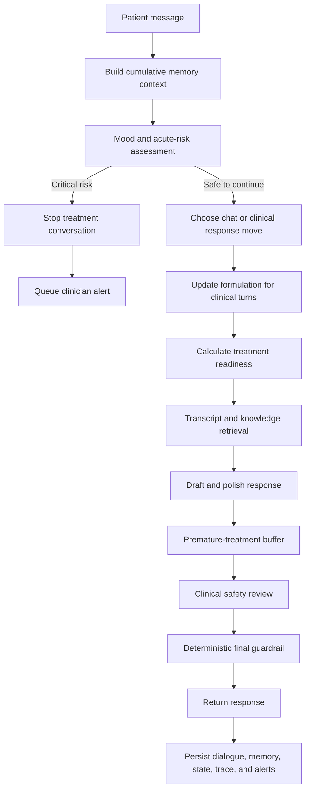

# Digital Doctor

> A safety-aware, memory-augmented dialogue prototype for OCD and Exposure and Response Prevention (ERP) research.

**Cumulative memory · Treatment buffering · Mood-aware risk routing · ERP safeguards · Human escalation**

Digital Doctor is a multi-turn clinical dialogue prototype designed to preserve continuity without rushing into treatment. It combines structured case formulation, transcript retrieval, PageIndex-backed knowledge retrieval, phased ERP planning, and layered safety controls in one auditable pipeline.

The system remembers what has already been discussed, waits until sufficient context has been collected before suggesting treatment, detects emotional instability before generation, and pauses the treatment flow when human intervention is needed.

> [!CAUTION]
> This repository is intended for research and supervised prototyping only. It does not diagnose, replace a licensed clinician, or provide emergency care. A locally queued alert is not proof that a human has received or acted on it.

## At a glance

| Capability | What it does |
| --- | --- |
| Cumulative memory | Preserves raw dialogue, incrementally summarizes long sessions, tracks topics, and recalls earlier context when the patient may have forgotten it. |
| Treatment readiness | Requires multiple clinical turns, core case-formulation fields, completion of Assessment/Formulation/ERP Buy-In, and a sufficiently regulated state before ERP suggestions are allowed. |
| Mood and risk detection | Assesses mood, emotional stability, and immediate risk before treatment content is generated. |
| Layered guardrails | Reviews drafts for reassurance, unsafe exposure, premature treatment, and medical or medication guidance. |
| Human escalation | Stops critical-risk conversations and writes a durable alert, with optional webhook delivery to a clinician-owned endpoint. |
| Auditable execution | Records state transitions, retrieval context, model artifacts, memory compaction, safety decisions, and alerts. |

## System flow



The ordering is intentional: risk assessment happens before treatment generation, while deterministic checks run both before and after the model-based safety review.

## Core design

### 1. Cumulative dialogue memory

Every turn is retained in an append-only JSONL archive. The active context is assembled from three layers:

- a durable long-term summary;
- relevant details recalled from older turns;
- a verbatim recent-turn window.

When unsummarized dialogue exceeds `MEMORY_SUMMARY_THRESHOLD_CHARS`, the system merges it with the existing long-term summary instead of replacing prior memory. Structured topics and reminders are persisted between compactions. Explicit forgetting language—such as “remind me” or “what did we discuss?”—triggers targeted recall and a natural reminder instruction.

### 2. Treatment recommendation buffer

Treatment is not unlocked on the first turn. By default, ERP guidance requires all of the following:

- at least `TREATMENT_MIN_CONTEXT_TURNS=3` clinical turns;
- populated `obsession`, `trigger`, and `compulsion` formulation fields;
- completed Assessment, Formulation, and ERP Buy-In phases;
- a `stable/low` or still-collaborative `strained/moderate` state.

Before readiness is reached, the system continues assessment and uses the selected conversational move. If the language model still produces an ERP action, ritual-delay instruction, homework assignment, or medication step, deterministic output checks replace it with a non-treatment response. Readiness only makes treatment discussion eligible: a concrete action is allowed only when the router separately selects `treatment_step`, so an acknowledgment or reflection cannot accidentally start exposure.

### 3. Safety guardrails

The final model-based reviewer can choose one of four actions:

| Action | Behavior |
| --- | --- |
| `allow` | Return a safe, ERP-consistent draft unchanged. |
| `revise` | Rewrite reassurance, unsafe exposure coaching, premature treatment, or inappropriate medical guidance. |
| `escalate` | Hand an out-of-scope or elevated-risk case to a human clinician. |
| `crisis` | Replace the response with crisis-oriented guidance and trigger urgent escalation. |

The reviewer explicitly distinguishes unwanted, ego-dystonic harm or taboo obsessions from genuine desire, plan, or intent. If the reviewer is unavailable, crisis backstops and treatment filters fail closed rather than silently approving unevaluated treatment advice.

### 4. Mood and risk state

Each patient message is classified before response generation:

| Stability | Typical handling | Treatment advice |
| --- | --- | --- |
| `stable` | Continue assessment or treatment-readiness evaluation. | Eligible only if every other readiness condition passes. |
| `strained` | Continue supportively and monitor whether the patient remains oriented and collaborative. | Eligible only if moderate or lower risk and every other readiness condition passes. |
| `unstable` | Hold treatment content and notify a human reviewer. | Blocked. |
| `critical` | Stop the current treatment conversation and initiate urgent escalation. | Prohibited. |

Risk is separately classified as `low`, `moderate`, `high`, or `critical`. High and critical states create a durable clinical alert. Critical state is restored from persisted session state after a process restart and remains active until the session is deliberately reset.

## Project structure

```text
.
├── .agent/goal.md                  # Project-wide goals, invariants, and acceptance criteria
├── digital_doctor/
│   ├── core/
│   │   ├── session.py              # End-to-end session orchestration
│   │   ├── session_logic.py        # Routing, generation, and memory summarization
│   │   └── session_store.py        # Raw turns, long-term memory, recall, and compaction
│   ├── retrieval/                  # Transcript RAG and knowledge-tree retrieval
│   ├── safety/
│   │   ├── risk.py                 # Pre-generation mood and risk assessment
│   │   ├── treatment.py            # Treatment readiness and deterministic output gates
│   │   ├── review.py               # Final clinical safety review
│   │   └── notifications.py        # Durable alert outbox and optional webhook delivery
│   ├── services/                   # OpenAI client and optional helper-model service
│   ├── tracking/milestones.py      # Case formulation and seven-phase ERP planner
│   ├── tools/                      # Demo, knowledge build, and impact-report utilities
│   └── web/                        # FastAPI server and single-page chat UI
├── pageindex/                      # Unmodified upstream PageIndex snapshot
├── train/                          # Integrated LLaMA-Factory training workspace and OCD datasets
├── tests/                          # Safety, memory, buffering, and phase-planner tests
├── data/                           # Local clinical inputs and generated knowledge artifacts
└── runtime/                        # Local cache, logs, traces, memory, and alert output
```

For the complete product intent and safety invariants, see [`.agent/goal.md`](.agent/goal.md).

The training stack is intentionally isolated from the runtime dependencies. See
[`train/README_DIGITAL_DOCTOR.md`](train/README_DIGITAL_DOCTOR.md) for installation,
dataset, fine-tuning, evaluation, and output-path details.

## Quick start

### Requirements

- Python 3.10
- Conda or another compatible Python environment manager
- an OpenAI API project key with access to its associated organization/project
- local transcript and milestone inputs

### 1. Create the environment

```bash
conda env create -f environment.yml
conda activate digital_doctor
```

Alternatively, install the dependencies in an existing Python 3.10 environment:

```bash
python -m pip install -r requirements.txt
```

### 2. Configure environment variables

```bash
cp .env.example .env
```

Set `OPENAI_API_KEY` in `.env`. Keep `.env` local—it is ignored by Git and must never be committed.

The default configuration keeps the optional helper model disabled:

```dotenv
OPENAI_MODEL=gpt-4o-mini
USE_HELPER_MODEL=0
USE_KNOWLEDGE_TREE=1
RESET_SESSION_FILES=1
USE_SAFETY_CHECK=1
MEMORY_SUMMARY_THRESHOLD_CHARS=12000
TREATMENT_MIN_CONTEXT_TURNS=3
```

### 3. Prepare local data

The repository ignores clinical/source data by default. Before starting a normal session, provide the files expected by the configured paths:

```text
data/
├── milestones.md
├── transcripts/101KI_deid.json
└── knowledge_trees/wilhelm_steketee_2006.tree.json   # when knowledge retrieval is enabled
```

If no knowledge tree is available yet, start with `--no-knowledge-tree`.

### 4. Run the CLI

```bash
python run.py
```

Useful alternatives:

```bash
# Start without the helper model or knowledge tree
python run.py --no-helper-model --no-knowledge-tree

# Preserve existing memory and session artifacts
python run.py --no-reset-session-files

# Change the treatment-readiness threshold
python run.py --treatment-min-context-turns 4
```

## Web interface

Start the FastAPI application:

```bash
uvicorn digital_doctor.web.server:app --host 0.0.0.0 --port 8000
```

Open `http://localhost:8000`. The single-page interface displays the current ERP phase, phase status, formulation coverage, and dialogue response.

### API endpoints

| Method | Endpoint | Purpose |
| --- | --- | --- |
| `GET` | `/` | Serve the web interface. |
| `GET` | `/api/state` | Return the current planner, memory, and safety snapshot. |
| `POST` | `/api/chat` | Process `{ "message": "..." }` and return `{ reply, snapshot, update }`. |
| `POST` | `/api/reset` | Start a fresh session and clear configured runtime artifacts. |

Chat turns are serialized with a lock so memory and tracker updates cannot interleave across concurrent requests.

## Configuration reference

| Variable | Default | Description |
| --- | --- | --- |
| `OPENAI_API_KEY` | required | OpenAI API project credential. |
| `OPENAI_MODEL` | `gpt-4o-mini` | Main model used for routing, formulation, generation, and safety tasks. |
| `USE_HELPER_MODEL` | `0` in `.env.example` | Enable the optional helper-model service. |
| `HELPER_API_URL` | `http://localhost:8001/helper/generate` | Helper service endpoint. |
| `HELPER_API_KEY` | empty | Optional helper-service credential. |
| `USE_KNOWLEDGE_TREE` | `1` | Enable PageIndex-backed knowledge retrieval. |
| `RESET_SESSION_FILES` | `1` | Clear session artifacts when a new CLI/web session is built. |
| `USE_SAFETY_CHECK` | `1` | Enable the model-based final review. Deterministic risk and treatment gates remain active independently. |
| `MEMORY_SUMMARY_THRESHOLD_CHARS` | `12000` | Unsummarized character threshold for incremental memory compaction. |
| `TREATMENT_MIN_CONTEXT_TURNS` | `3` | Minimum clinical turns before treatment can become eligible; code enforces a floor of 2. |
| `CLINICAL_ALERT_WEBHOOK_URL` | empty | Optional clinician-owned endpoint for high/critical-risk alerts. |
| `SAFETY_CRISIS_RESOURCES` | built-in text | Region-specific crisis-resource override. |
| `TRANSCRIPT_PATH` | `data/transcripts/101KI_deid.json` | Reference transcript input. |
| `MILESTONE_PATH` | `data/milestones.md` | Milestone definition input. |
| `KNOWLEDGE_TREE_PATH` | default generated tree | PageIndex-normalized knowledge tree. |

Command-line arguments can override the principal paths and readiness thresholds. Run `python run.py --help` for the complete list.

## Runtime artifacts

Interactive sessions write to `runtime/logs/interactive/` by default:

| File | Contents |
| --- | --- |
| `milestone_memory.jsonl` | Append-only raw dialogue archive. |
| `milestone_long_term_memory.json` | Durable summary, topic ledger, reminders, and compaction state. |
| `milestone_state.jsonl` | Per-turn update payload and planner snapshot. |
| `milestone_trace.jsonl` | Routing, retrieval, generation, memory, mood, readiness, safety, and detailed milestone diagnostics. |
| `milestone_debug.log` | Compact operational log, including one `[milestone]` health/progression summary per turn. |
| `milestone_clinical_alerts.jsonl` | Durable human-escalation outbox. |

These files can contain sensitive clinical content. Production deployments require an explicit retention policy, encryption, access controls, redaction strategy, and audit process.

The planner emits `milestone_formulation_inference`, `milestone_formulation_updated`,
`milestone_phase_inference`, `milestone_phase_floor_applied`,
`milestone_state_transition`, and `milestone_health` events. The per-turn update and
API snapshot also expose `milestone_health.status`: `not_run` before the first clinical
turn, `healthy` when phase output and ordering invariants are valid, and `degraded`
when model output is malformed/incomplete or the phase state is inconsistent.

## Testing

Run the complete test suite:

```bash
python -m unittest discover -s tests -v
```

The suite covers:

- incremental memory compaction, reload, topic retention, and forgetting recall;
- treatment-readiness thresholds and premature-advice replacement;
- deterministic blocking of dangerous treatment or medication guidance;
- mood instability and critical-risk session stops;
- differentiation of ego-dystonic intrusive thoughts from genuine intent;
- durable alert creation and critical-state restoration;
- fail-closed behavior when the safety model is unavailable;
- structured formulation and phase-planner progression.

To perform a syntax-only check:

```bash
python -m compileall -q digital_doctor tests
```

Run a gold-prefix comparison against a role-play transcript:

```bash
python -m digital_doctor.tools.gold_prefix_eval \
  --docx dev/RolePlay_Tasha_Adam_OCD_ERPbuyin.docx \
  --therapist-speaker Bailen
```

The evaluator reconstructs memory, formulation, and phase state from the original prefix at every checkpoint. It saves an English clinician-facing `clinical_turn_comparison_en.html`, a Chinese technical `implementation_report_zh.html`, and raw JSONL under `runtime/evals/`.

## Knowledge tree and research utilities

### Build the PageIndex knowledge tree

```bash
python -m digital_doctor.tools.build_knowledge_tree
```

The project wrapper performs source preprocessing and normalizes PageIndex output into the project schema. The bundled `pageindex/` directory is treated as an upstream snapshot and should remain unmodified.

### Generate an automated dialogue

```bash
python -m digital_doctor.tools.demo
```

Demo artifacts are written under `runtime/logs/demo_dialogue/<run_id>/`, including the dialogue, turn-level retrieval context, trace, state, and a human-readable report.

### Generate a PageIndex impact report

```bash
python -m digital_doctor.tools.pageindex_impact_report
```

The report compares transcript-only and knowledge-tree-assisted candidates and writes CSV, JSON, and Mermaid artifacts under `data/demo_output/`.

### Clean generated artifacts

```bash
python -B scripts/clean_workspace.py
```

This clears generated runtime logs and transcript-summary cache while preserving the latest knowledge-tree build artifacts.

## Troubleshooting

<details>
<summary><strong>The API returns 401 or <code>invalid_organization</code></strong></summary>

The request reached OpenAI, but the key is invalid or cannot access its associated project/organization. Verify that the project key is active and that the account still has access to the organization that created it. A ChatGPT subscription and OpenAI API access are separate.

</details>

<details>
<summary><strong>The first run is slow</strong></summary>

Transcript segments may be summarized and cached in `runtime/cache/segment_summaries.jsonl`. Later retrieval calls can reuse that cache.

</details>

<details>
<summary><strong>The application reports a missing transcript, milestone, or tree</strong></summary>

Clinical/source data is intentionally ignored by Git. Add the required local files, override their paths through environment variables or CLI arguments, or disable knowledge-tree retrieval when only the tree is missing.

</details>

<details>
<summary><strong>An alert says <code>queued_local</code></strong></summary>

The alert is durable on disk but has not been delivered to a human endpoint. Configure and monitor `CLINICAL_ALERT_WEBHOOK_URL`, or integrate `ClinicalAlertNotifier` with the organization’s alerting system before any supervised deployment.

</details>

## Clinical and operational boundaries

- This is a research prototype, not a medical device or autonomous therapist.
- Language-model classifications can be wrong, incomplete, or biased.
- A webhook must be tested and monitored; local persistence alone is not clinical notification.
- Crisis resources must be localized to the deployment region.
- Production use requires clinician governance, privacy review, threat modeling, incident response, and adversarial safety evaluation.
- No patient-identifiable or confidential source data should be committed to the repository.

---

Built as an auditable foundation for safer, continuity-aware OCD dialogue research.
