# Digital Doctor

**Harness-Guided Clinical Skill Distillation for Longitudinal Therapeutic Dialogue**

Digital Doctor is a research framework for studying how executable clinical skills can supervise longitudinal dialogue models. The current implementation focuses on obsessive-compulsive disorder (OCD) and Exposure and Response Prevention (ERP).

The central idea is to separate three concerns:

- a stable **execution harness** that owns orchestration, memory, authorization, safety stops, persistence, and audit traces;
- a versioned **clinical skill** that defines clinical state, phase progression, action policy, prompts, treatment readiness, and domain review;
- a replaceable **language model** that generates candidate actions and responses through a common adapter.

This repository implements the execution and data-generation infrastructure for Harness-Guided Skill-Conditioned On-Policy Self-Distillation (HG-SC-OPSD). Training and evaluation of the learned method are ongoing.

> [!CAUTION]
> This code is for research and supervised prototyping. It is not a medical device, does not replace a licensed clinician, and must not be used for emergency care.

## Method

Response-only supervised fine-tuning teaches a model what a clinician said, but does not explicitly supervise why a particular clinical move was appropriate at that point in a dialogue. Digital Doctor represents this hidden decision process as structured, auditable context:

```text
clinical state + state delta + treatment phase
+ allowed/selected action + readiness
+ retrieved evidence + safety constraints
```

During distillation, the student observes only the dialogue, while the teacher also receives this privileged skill context. The intended objective jointly supervises clinical state, action selection, and the final response. At deployment time, the external harness remains responsible for authorization and safety.

```mermaid
flowchart LR
    A[Patient turn] --> B[Harness context and stop check]
    B --> C[Clinical skill: risk, state, action]
    C --> D[Harness action authorization]
    D --> E[Evidence retrieval]
    E --> F[Prompt / SFT / OPSD model]
    F --> G[Clinical skill review]
    G --> H[Harness final gate and commit]
    H --> I[Versioned trace for evaluation or distillation]
```



Each run records the exact execution identity:

```json
{
  "harness_version": "1.0.0",
  "skill_id": "ocd_erp",
  "skill_version": "1.0.0",
  "skill_checksum": "<sha256>",
  "model_adapter": "prompt-model"
}
```

## System boundaries

| Component | Responsibility |
| --- | --- |
| Harness | Session lifecycle, memory, retrieval execution, model adapters, action authorization, persistent safety stop, alerts, traces, and state commit |
| Clinical skill | State schema, phase graph, action ontology, treatment readiness, prompts, and domain-specific response review |
| Model | Candidate generation; it cannot authorize its own treatment actions or bypass harness safety |

A turn follows a fixed sequence:

1. Build `TurnContext` from the patient message and cumulative memory.
2. Enforce any persisted safety stop.
3. Ask the active skill for a `StateDelta` and `ActionPlan`.
4. Authorize the action against declared actions and treatment readiness.
5. Retrieve configured transcript, knowledge-tree, or helper evidence.
6. Generate through the selected `ModelAdapter`.
7. Apply skill-specific review and the harness-owned final gate.
8. Persist memory, clinical state, alerts, audit events, and a distillation record.

If clinical review fails, output is empty, or an unauthorized treatment action is not proven to have been removed, the harness fails closed.

## OCD/ERP skill

The default `ocd_erp@1.0.0` skill contains:

- a structured OCD formulation schema;
- a seven-phase longitudinal therapy graph;
- a constrained clinical action space;
- minimum-context and phase-based treatment readiness;
- safeguards against reassurance, premature ERP, unsafe exposure, and medication advice;
- risk handling that distinguishes ego-dystonic intrusive thoughts from evidence of genuine intent.

The skill is an executable policy bundle rather than a prompt directory. Changes to its state, action, phase, or safety behavior require a new manifest version.

## Repository structure

```text
.
├── digital_doctor/
│   ├── harness/                # Contracts, runner, registry, adapters, safety
│   ├── skills/ocd_erp/         # Versioned executable clinical skill
│   ├── core/                   # Session wiring, memory, persistence
│   ├── retrieval/              # Transcript and knowledge-tree retrieval
│   ├── services/               # Model and helper-service clients
│   ├── tracking/               # Formulation and phase state
│   ├── tools/                  # Evaluation, trace export, and research tools
│   └── web/                    # FastAPI interface
├── pageindex/                  # Unmodified third-party PageIndex snapshot
├── train/                      # LLaMA-Factory and registered OCD datasets
├── tests/                      # Runtime, safety, architecture, and eval tests
├── data/                       # Local source data; ignored by Git
└── runtime/                    # Generated traces and reports; ignored by Git
```

`pageindex/` remains separate from the application package so upstream code and project-owned retrieval logic have a clear boundary.

## Setup

Requirements: Python 3.10 and an OpenAI API project key for model-backed execution.

```bash
conda env create -f environment.yml
conda activate digital_doctor
cp .env.example .env
```

Set `OPENAI_API_KEY` in `.env`. Credentials and generated artifacts are excluded from version control.

The runtime expects local clinical inputs at the configured paths:

```text
data/milestones.md
data/transcripts/101KI_deid.json
data/knowledge_trees/<tree>.json       # optional
```

Run the command-line interface:

```bash
python run.py --no-helper-model --no-knowledge-tree
```

Pin the clinical policy used by a run:

```bash
python run.py --skill-id ocd_erp --skill-version 1.0.0
```

Run the web interface:

```bash
uvicorn digital_doctor.web.server:app --host 0.0.0.0 --port 8000
```

## Distillation traces

Every completed turn emits a `distillation_record` containing:

- dialogue-only student input;
- privileged clinical state and state delta;
- selected and authorized action;
- treatment readiness and retrieved evidence;
- reviewed teacher response and safety metadata;
- harness, skill, checksum, and model-adapter identity.

Export the same trace for skill-conditioned distillation or standard SFT:

```bash
python -m digital_doctor.tools.export_skill_traces \
  runtime/logs/interactive/milestone_trace.jsonl \
  train/output/opsd.jsonl --format opsd

python -m digital_doctor.tools.export_skill_traces \
  runtime/logs/interactive/milestone_trace.jsonl \
  train/output/sft.jsonl --format sft
```

The integrated LLaMA-Factory workspace is under `train/`. Checkpoints, optimizer state, experiment logs, and generated outputs remain local.

## Evaluation

Run the project test suite:

```bash
python -m unittest discover -s tests -v
```

Run a gold-prefix evaluation from a role-play transcript:

```bash
python -m digital_doctor.tools.gold_prefix_eval \
  --docx path/to/transcript.docx \
  --therapist-speaker <speaker>
```

Compare the harness against a raw-model baseline with a supplied evaluation rubric:

```bash
python -m digital_doctor.tools.harness_workflow_eval \
  --docx path/to/transcript.docx \
  --rubric path/to/rubric.html \
  --therapist-speaker <speaker>
```

Generated evaluation files are written under `runtime/evals/` and are not committed. The planned blinded human evaluation measures clinical appropriateness, phase timing, longitudinal continuity, doctor-like communication, usefulness, safety, and overall preference. Statistical analysis should treat the trajectory or session—not an isolated turn—as the primary unit.

## Extending the framework

To add a model backend, implement:

```python
ModelAdapter.generate(GenerationSpec) -> str
```

To add a clinical domain, implement the `ClinicalSkill` protocol and register an immutable skill version. Harness-owned stop, alert, authorization, trace, and final-gate behavior must remain outside the skill.

## Safety and privacy

- Runtime risk classifications and generated responses may be wrong.
- Local alert persistence does not guarantee that a clinician received an alert.
- Crisis resources must be localized and operationally validated.
- Clinical deployment requires independent governance, privacy review, access control, monitoring, and adversarial safety evaluation.
- Patient-identifiable or confidential data must not be committed to this repository.

## Citation

Paper and citation information will be added with the research release.
